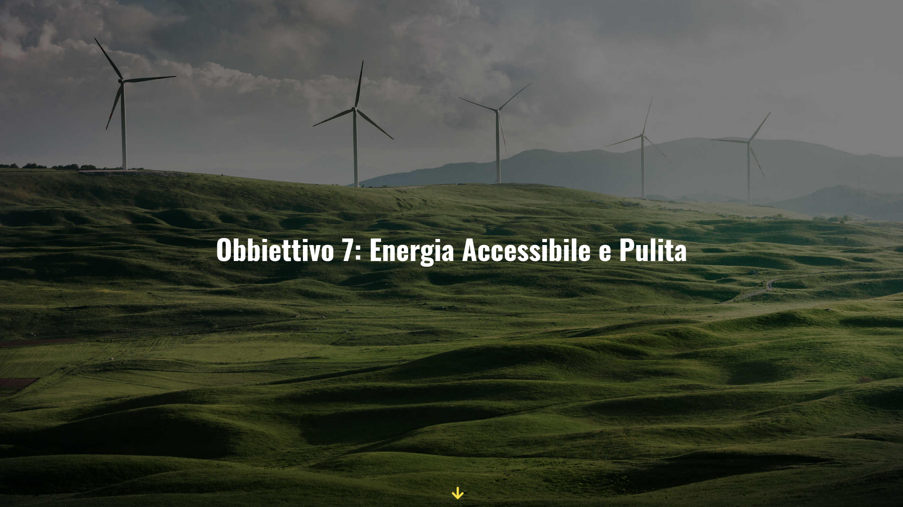
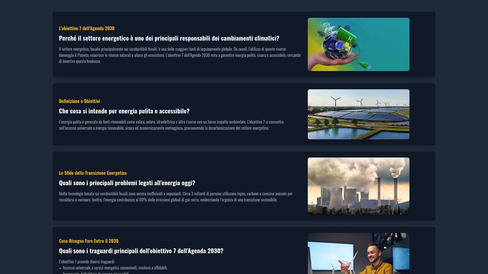
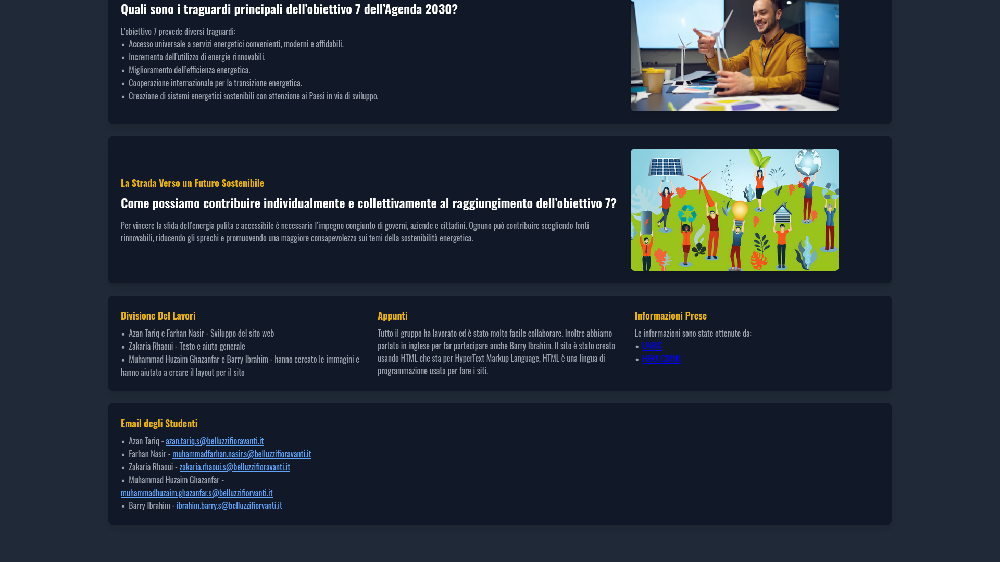

# [Obbiettivo 7](https://obbiettivo7.netlify.app/) - Archived - School project December 21 2024.

A website about the 2030 goals, In particularly Goal n7. That offers Ensure access to affordable, reliable, sustainable and modern energy for all.

---

## Screenshots 

---

## How was the website made?

Originally the website was for a school project. We didnt want to use google slides so we made a website.
Me and my friend Azan made the structure and the code. The other 3 made the text and gave us support.
We used HTML and TAIlWIND. 

## Howd you get the website working and keeping it online?

Well this is where we ran in to an issue. We didnt have a server so we hosted the website on netlify.app. Yes a free website hoster.

---

## Any plans for this Archieved project?

Yes actually. im planning on giving it another shot in the future. For now it shall remain archieved. The text,and the main idea of the website will surely stay the same but everything else wll be changed.
